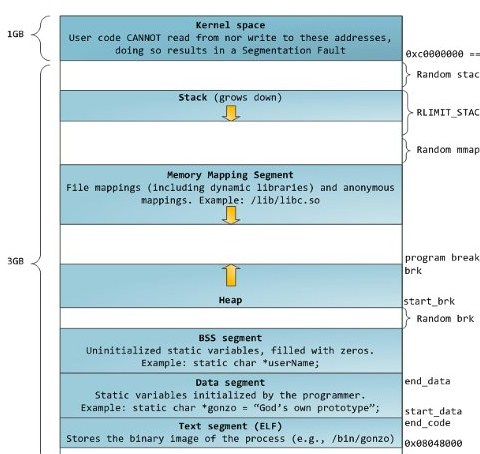

- [C++](#c)
  - [STL](#stl)
    - [vector](#vector)
    - [list](#list)
    - [deque](#deque)
    - [priority_queue](#priority_queue)
    - [map、set、multimap、multiset](#mapsetmultimapmultiset)
    - [unordered_map、unordered_set](#unordered_mapunordered_set)
  - [内存模型](#内存模型)
- [问答](#问答)
  - [为什么空类大小为1](#为什么空类大小为1)
  - [可不可以通过未实例化的类指针调用类内的函数](#可不可以通过未实例化的类指针调用类内的函数)

# C++
## STL
STL包含6大组件:容器、迭代器、算法、仿函数、适配器和空间配置器
+ 容器:容纳一组元素的对象，顺序容器(线性结构，元素位置与元素本身无关)、关联容器(非线性结构，元素位置和元素本身相关)
+ 迭代器:提供一种访问容器中每个元素的方法
+ 算法:用来处理容器内的元素，包括查找算法、排序算法
+ 仿函数:一种类似于函数的对象
+ 适配器:一种接口类，容器适配器、迭代器适配器、函数适配器
+ 空间配置器:负责空间的分配和管理。申请内存大于128byte时启动一级配置器直接malloc，小于128byte时启动二级配置器从由不同大小的空闲链表组成的内存池中分配

### vector
动态数组，支持随机存取。                 
当空间不够装下数据(size>=capacity)时，会自动申请一块连续的1.5倍或者2倍(下一次申请的内存大小大于之前的总和，之前分配的内存不能被重复使用)大小的空间，然后把原来的数据拷贝到新的内存空间，最后释放掉原来的空间(导致迭代器失效)。                 
size是vector中元素实际数目，capacity是能容纳的最大数目，增加或删除元素时只有size会变。                 

### list
双向链表

### deque
双端队列，头尾插入、删除高效

### priority_queue
优先队列，用大根/小根堆实现的

### map、set、multimap、multiset
红黑树

### unordered_map、unordered_set
哈希表

##  内存模型
                  
stack:栈区，自动分配释放，存放程序临时创建的局部变量，常用来保存/恢复调用现场，函数调用时参数会被压入栈，调用结束后返回值也会被压入栈
heap:堆区，手动分配释放，存放程序中动态分配的内存段
bss:存放程序中未初始化的全局/静态变量，不给该段数据分配空间，
data:存放程序中已初始化的全局/静态变量，给该段数据分配空间
text:用来存放程序执行代码和一些只读的常数变量，大小在程序运行前已经确定

# 问答
## 为什么空类大小为1
为了使空类实例化得到独一无二的地址，编译器会给空类隐含的加一个字节

## 可不可以通过未实例化的类指针调用类内的函数
若为虚函数不行，没有虚函数表指针指向虚函数表
若为普通函数可以