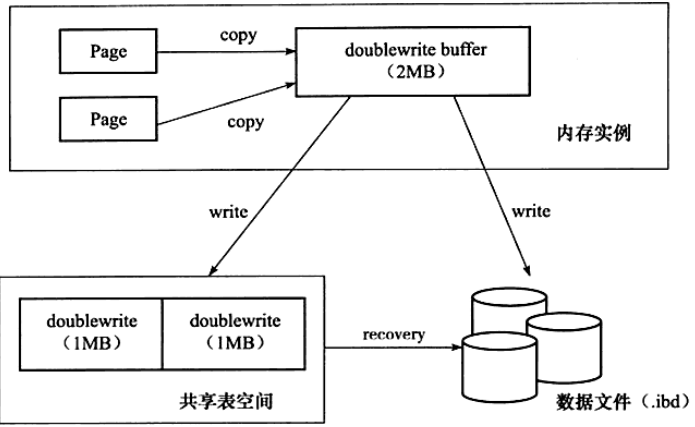
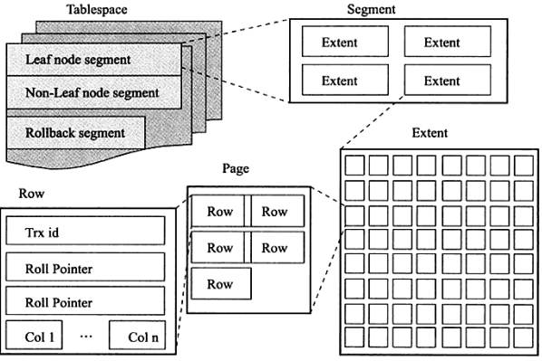
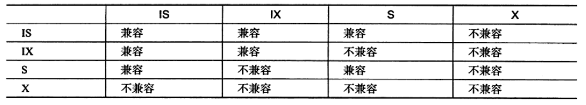
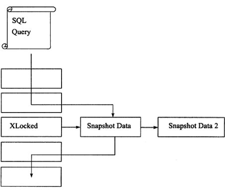
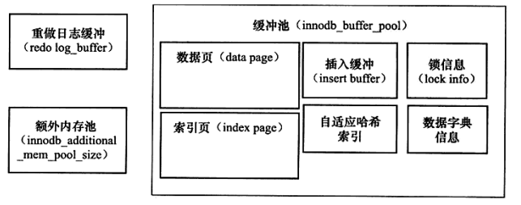
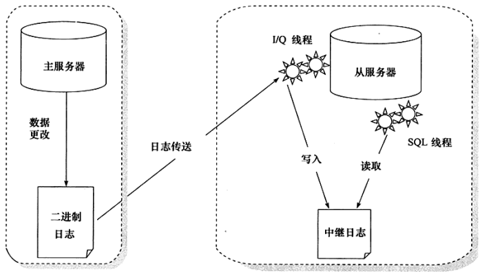

- [MySQL](#mysql)
  - [数据库三大范式](#数据库三大范式)
  - [MyISAM与InnoDB的区别](#myisam与innodb的区别)
  - [脏读、不可重复读、幻读](#脏读不可重复读幻读)
  - [Multi-version concurrency control(MVCC多版本并发控制)](#multi-version-concurrency-controlmvcc多版本并发控制)
  - [事务](#事务)
    - [事务的ACID特性](#事务的acid特性)
    - [事务的隔离级别](#事务的隔离级别)
    - [事务的实现](#事务的实现)
      - [redo](#redo)
      - [undo](#undo)
  - [InnoDB的关键特性](#innodb的关键特性)
    - [Insert Buffer插入缓冲](#insert-buffer插入缓冲)
    - [Double Write两次写](#double-write两次写)
    - [Adaptive Hash Index自适应哈希索引](#adaptive-hash-index自适应哈希索引)
    - [Async IO异步IO](#async-io异步io)
    - [Flush Neighbor Page刷新邻接页](#flush-neighbor-page刷新邻接页)
  - [InnoDB逻辑存储结构](#innodb逻辑存储结构)
  - [索引](#索引)
    - [聚集索引](#聚集索引)
    - [非聚集索引](#非聚集索引)
    - [联合索引](#联合索引)
    - [覆盖索引](#覆盖索引)
    - [自适应哈希索引](#自适应哈希索引)
    - [前缀索引](#前缀索引)
    - [索引的数据结构](#索引的数据结构)
      - [B+树索引](#b树索引)
      - [Hash索引](#hash索引)
    - [索引底层优化](#索引底层优化)
    - [索引失效](#索引失效)
    - [创建索引的原则](#创建索引的原则)
  - [锁](#锁)
    - [lock、latch](#locklatch)
    - [共享锁(S Lock)与排他锁(X Lock)](#共享锁s-lock与排他锁x-lock)
    - [意向锁](#意向锁)
    - [一致性非锁定读(快照读)](#一致性非锁定读快照读)
    - [一致性锁定读(当前读)](#一致性锁定读当前读)
    - [行锁的算法](#行锁的算法)
    - [乐观锁与悲观锁](#乐观锁与悲观锁)
    - [封锁协议](#封锁协议)
    - [两段锁协议](#两段锁协议)
    - [外键与锁](#外键与锁)
  - [数据完整性](#数据完整性)
  - [InnoDB的后台线程分类](#innodb的后台线程分类)
  - [InnoDB的内存管理](#innodb的内存管理)
    - [缓冲池](#缓冲池)
    - [LRU List](#lru-list)
    - [Free List](#free-list)
    - [Flush List](#flush-list)
    - [Check Point机制](#check-point机制)
  - [视图](#视图)
  - [分区](#分区)
  - [备份与复制](#备份与复制)
    - [备份](#备份)
    - [复制](#复制)

#   MySQL
##  数据库三大范式
第一范式:每个列都不可再拆分
第二范式:在第一范式的基础上，非主键列完全依赖于主键，而不能只依赖于主键的一部分
第三范式:在第二范式的基础上，非主键列只依赖于主键，不依赖于其他非主键

##  MyISAM与InnoDB的区别
|   MyISAM  |   InnoDB  |   
|    :---:      |    :---:      |
|   不支持事务  |   支持事务    |
|   不支持外键  |   支持外键    |
|   索引的叶子节点存放的是数据文件的地址指针  |   聚集索引的叶子节点存放的是磁盘上实际的数据文件，非聚集索引的叶子节点存放的是主键值    |
|   支持表级锁  |   支持表级锁与行级锁  |
|   可以没有主键  |   必须要有主键，如果不主动设置会默认产生一个  |
|   按插入顺序保存记录    |   按主键顺序保存记录    |

##  脏读、不可重复读、幻读
+ 脏读:在不同的事务下，当前事务可以读取另外一个事务未提交的数据，违反了数据库的隔离性。
+ 不可重复读:在一个事务内多次读取同一数据集合，由于另外事务的修改导致多次读取的数据不一样。
+ 幻读:在一个事务内多次读取同一数据集合，由于另外事务的插入删除导致多次读取的数据数目不一样。
不可重复读与脏读的区别在于，脏读读取的是未提交的数据，而不可重复读读取的是已经提交的数据。

##  Multi-version concurrency control(MVCC多版本并发控制)
解决读写冲突，实现了一致性非锁定读，当行被锁定时，通过读取行的快照数据实现一致性读。只适用于Read Committed与Repeatable Read隔离级别。
每行记录后面保存了两个隐藏的列，分别存储了这个行的创建与删除的系统版本号。

##  事务
事务是一个数据库操作序列，也是数据库并发控制的基本单位。
### 事务的ACID特性
Atomicity:原子性，事务作为一个不可分割的工作单位，事务中的操作要么都执行要么都不执行。      
Consisitency:一致性，执行事务前后数据库的完整性约束没有被破坏，事务使得系统从一个一致的状态转换到另一个一致的状态。
Isolation:隔离性，该事务提交前对其他事务都不可见。一个事务不会被其他事务干扰。
Durability:持久性，事务一旦提交，其结果就是永久性的，即使发生宕机等故障，数据库也能将数据恢复。

### 事务的隔离级别
+ Read Uncommitted:对写加X锁，事务结束释放。对读不加锁。
+ Read Committed:避免脏读。一致性锁定读时，会采用Record Lock锁算法。对写加X锁，事务结束释放。一致性非锁定读通过MVCC获取锁定行的最新一份快照数据。
+ Repeatable Read:避免脏读与不可重复读。InnoDB默认隔离级别，一致性锁定读时，会采用Next Key Lock锁算法，也可避免幻读。对写加X锁，事务结束释放。一致性非锁定读通过MVCC获取锁定行的事务开始时的快照数据。
+ Serializable:避免脏读、不可重复读与幻读。也可以解决逻辑上的丢失更新问题(两个事务同时读取数据，事务A修改之后，事务B再修改)。对写加X锁，事务结束释放。每个读操作都会默认加S锁。两段锁协议。    

### 事务的实现
####  redo
redo日志由两部分组成:内存中易失的redo log buffer、持久的redo log file。       
通过重做日志用来实现事务的持久性。当事务提交时，必须先将事务的所有日志都写入到重做日志文件进行持久化，待事务的提交操作完成才算完成提交的整体操作。
MySQL还有一种二进制日志(binlog),与redo log很相似。
|   redo log    |   binlog    |
|   :---:       |   :---:     |
|   产生于InooDB存储引擎层    |   产生于数据库上层，不限存储引擎    |
|   物理格式日志，记录的是对每个页的修改    |   逻辑日志，记录的是对应的SQL语句   |
|   在事务进行中不断地被写入    |   在事务提交完成后进行一次写入    |
####  undo
undo日志存放于数据库共享表空间内地undo段中。    
通过undo日志进行回滚操作。undo日志是逻辑日志，回滚后只确保逻辑恢复到原本的样子，物理存储可能会发生变化。

##  InnoDB的关键特性    
### Insert Buffer插入缓冲
使用条件 : 非聚集且不唯一的索引   
在进行插入操作时，插入顺序很可能不是顺序的，如果不使用InsertBuffer则需要离散的访问非聚集索引页(随机读取的性能低于顺序读取)。    
使用InsertBuffer后，先判断插入或更新的非聚集索引页是否存在于InsertBuffer中，如果存在则直接插入，如果不存在则先加入到一个InsertBuffer中。之后在一定的频率和条件下进行InsertBuffer与非聚集叶子节点的合并操作。    
缺点 : 进行大量的非聚集且不唯一的索引的插入操作时(使用了大量InsertBuffer)，若此时数据库发生了宕机，会有很多InsertBuffer没有合并到非聚集索引中去，恢复会需要很长时间。   
Change Buffer : InsertBuffer的升级，包含Insert Buffer(INSERT、UPDATE)、Delete Buffer(DELETE)、Purge Buffer。使用条件仍为非聚集且不唯一的索引。一阶段使用InsertBuffer或DeleteBuffer将记录标记为删除，二阶段使用PurgeBuffer将记录真正删除。

### Double Write两次写
部分写失效 : 正在从内存往磁盘写入页时发生数据库宕机，只写了一部分。当页本身发生了损坏，是无法通过redo日志进行重做恢复的，因为redo日志记录的是对页的物理操作。   
<!--       -->
 
两次写机制由两部分组成 : 内存中的2MB大小的DoubleWriteBuffer与物理磁盘上共享表空间中一共2MB大小的128个连续的DoubleWrite页。    
对缓冲池的脏页进行刷新时，先将脏页复制到内存中的DoubleWriteBuffer，然后通过DoubleWriteBuffer分两次每次1MB顺序写到磁盘上共享表空间中的DoubleWrite页，最后将DoubleWriteBuffer离散地写入到各个目的表空间中。   
当把页写入磁盘时发生了崩溃，恢复过程中可以在共享表空间中的DoubleWrite中找到页的副本，通过该副本来还原损坏的页，再进行重做。

### Adaptive Hash Index自适应哈希索引
InnoDB会自动根据访问的频率和模式来自动地为某些热点页建立哈希索引。    
自适应哈希索引通过缓冲池的B+树页构建而来，因此建立的速度很快，而且不需要对整张表构建哈希索引。

### Async IO异步IO
使用异步IO来避免IO的等待时间以及进行合并多个IO操作

### Flush Neighbor Page刷新邻接页
当刷新一个脏页时会检测该页所在区的所有页，若有脏页则一并刷新。可以通过AIO将多个IO操作合并为一个IO操作。

##  InnoDB逻辑存储结构
<!--    -->
  
表空间-段-区-页-行

##  索引
索引包含着数据表里所有数据记录的指针，相当于目录。使用索引可以提升数据的检索速度，但是为了维护索引也会有时间、空间上的开销。
### 聚集索引
表中数据以主键顺序存放，聚集索引按照每张表的主键构建一棵B+树，叶子节点中存放表的行记录数据，也将聚集索引的叶子节点称为数据页。    
查询优化器倾向于使用聚集索引:
+ 可以在聚集索引的叶子节点上直接找到数据
+ 聚集索引定义了数据的逻辑顺序，能够快速地进行针对范围值地查询    

### 非聚集索引
叶子节点存储行数据的聚集索引键。通过非聚集索引查找数据时，先找到行数据在非聚集索引上的叶子节点，再通过叶子节点中存储的主键去聚集索引上查找一个完整的行记录(回表查询)。

### 联合索引
联合索引是指对表上的多个列进行索引。可以只使用联合索引的左侧连续的一部分索引进行查询(最左前缀匹配原则)。
对于联合索引(a,b,c)，可以使用(a)、(a,b)、(a,b,c)来进行索引查询。对于(a,c)来说，只会走(a)，索引c失效。对于(b,c)来说，走全表检索，索引b、c全部失效。          
好处:
+ 联合索引对后面的键值也进行了排序处理。
+ 可以覆盖索引。

### 覆盖索引
从非聚集索引中就可得到查询的记录，而不需要查询聚集索引中的记录，避免了回表查询。  
好处:    
+ 通过使用覆盖索引可以减少大量的IO操作，因为非聚集索引不包含整行记录的所有信息，大小要小于聚集索引。

### 自适应哈希索引
使用链表法解决碰撞。    

### 前缀索引
使用字段的前几个字符建立索引。前提是前缀的标识度高。

### 索引的数据结构
####  B+树索引
|   B树   |   B+树    |
|   :---: |   :---:   |
|   键与值存在于任何节点    |   键存在于任何节点，值仅存在于叶子节点    |
|   根节点独立    |   根节点通过链表相连    |
|   内部节点中的键数比子节点数少一    |   内部节点中的键数等于子节点数    |
B树的优点:      
+ 可以把频繁访问的热点数据放在靠近根节点的位置来提升查询效率。      

B+树的优点:       
+ 由于内部节点不存放值，一次读取可以获得更多的键，可以更快地缩小查找范围，减少IO次数。        
+ 与B树相比，结构更加矮胖，层数更少，减少IO次数。     
+ 遍历时，可以通过根节点的链表进行快速地顺序遍历。
+ 每个查询都需要从根节点到叶子节点，查询效率更加稳定。

####  Hash索引
进行查找时，调用一次Hash函数就可以获取到相应的记录指针。只支持等值查询。
Hash索引的缺点:     
+ 哈希索引只包含哈希值与行指针，不存储字段值，所以不能使用索引中的值来避免读取行(覆盖索引、聚集索引)。
+ 哈希索引无法用于排序
+ 哈希索引不支持部分索引列匹配查找
+ 哈希索引不支持范围查找
+ 当发生哈希碰撞时，会影响到查找的性能

### 索引底层优化
+ Multi-Range Read:根据辅助索引进行范围查询(range,ref,eq_ref类型)时，将查询到的辅助索引键值存放于一个缓存中(此时根据辅助索引键值排序)，然后将缓存中的键值根据rowid进行排序，最后根据排序后的键值进行访问实际的数据文件。MRR使得范围查询以主键顺序进行回表查找，同时减少了缓冲池中页被替换的次数。     
+ Index Condition Pushdown:在取出索引的同时，判断是否可以进行WHERE条件的过滤(将WHERE的部分过滤操作放在了存储引擎层)。

### 索引失效
+ 未遵守最左匹配原则
+ 使用不等于(!=或<>)
+ 在索引上做计算、函数、类型转换
+ 以%开头的like查询
+ 使用了or且or条件中的列不全有索引
+ 范围条件右边的列
+ 使用is null/is not null判断
+ 索引字段为字符串，但查询时未加单引号
+ 当全表搜索比使用索引快时
  
### 创建索引的原则
+ 最左前缀匹配原则
+ 较频繁作为查询条件的字段才去创建索引
+ 较频繁更新的字段不适合创建索引
+ 不能有效区分数据的字段不适合作为索引，如性别，只能分两种
+ 外键一定要创建索引

##  锁
### lock、latch
   

### 共享锁(S Lock)与排他锁(X Lock)
   
共享锁与排他锁都是行锁。行锁基于索引，如果SQL语句没用到索引是不会使用行锁的，会用表锁把整张表锁住。      

### 意向锁
InnoDB支持表级意向锁。
意向共享锁:事务想要获得一张表中某几行的共享锁。     
意向排他锁:事务想要获得一张表中某几行的排他锁。
     

### 一致性非锁定读(快照读)
如果读取的行正在执行UPDATE或者DELETE，InnoDB会通过多版本并发控制(MVCC)的方式读取行的一个快照数据(通过undo段来实现快照)，不用等待行上X锁的释放。

### 一致性锁定读(当前读)
+ SELECT ... FOR UPDATE               (X LOCK)
+ SELECT ... LOCK IN SHARE MODE       (S LOCK)
若SELECT的是有索引的列，会加相应的行锁，否则会加表锁。

### 行锁的算法
+ Record Lock:单条索引记录上加锁，锁住的永远是索引，而非记录本身。
+ Gap Lock:在索引记录之间的间隙中加锁，或者是在某一条索引记录之前或者之后加锁，并不包括该索引记录本身。
+ Next Key Lock:Record Lock + Gap Lock，锁定一个范围且锁定索引记录本身。
RR隔离级别下，默认使用Next Key Lock。当查询唯一索引时，InnoDB会将Next Key Lock进行优化降级为Record Lock，提高并发性。
RC隔离级别下，默认使用Record Lock。外键约束和唯一性检查会使用Gap Lock。
Gap Lock可以解决可重复读模式下的幻读问题，同理Next Key Lock也可以。

### 乐观锁与悲观锁
悲观锁:假定会发生并发冲突，在获取数据前先进行加锁再修改。悲观锁依赖于数据库锁，效率低，更新失败的概率较低。适用于多写的场景。       
乐观锁:假定不会发生并发冲突，只在数据进行提交更新的时候才会对数据的冲突与否进行检测。可以使用版本号机制或CAS算法实现。乐观锁并未真正加锁，效率高，但是锁的粒度掌握不好，更新失败的概率就会较高，容易发生业务失败。适用于少写多读、冲突较少的场景，可以提高吞吐量。

### 封锁协议
一级封锁协议:对数据修改前，必须对其加X锁，直到事务结束才释放。    
二级封锁协议:在一级封锁协议的基础上，对数据读取前，必须对其加S锁，读完即可释放。    
三级封锁协议:在一级封锁协议的基础上，对数据读取前，必须对其加S锁，直到事务结束才释放。

### 两段锁协议
第一阶段:获得锁，事务可以获得任何数据上的任何锁，但不能释放
第二阶段:释放锁，事务可以释放任何数据上的任何锁，但不能获取
若并发执行的所有事务均遵循两段锁协议，则这些事务的任何并发调度策略都是可串行化的。

### 外键与锁
外键必须得加索引，可以避免表锁，防止死锁，InnoDB默认添加外键索引。    
对于外键值的插入或者更新，首先需要查询父表中的记录，此时使用的是加S锁的一致性锁定读(防止数据不一致)。   

##  数据完整性
约束 : 
+ Primary Key
+ Unique Key
+ Foreign Key
+ Default
+ Not Null

实体完整性 : 保证表中有一个主键。
+ 通过Primary Key或Unique Key    
+ 编写触发器    

域完整性 : 保证数据每列的值满足特定的条件。   
+ 选择合适的数据类型确保一个数据值满足特定条件
+ Foreign Key或Default
+ 编写触发器    
    
参照完整性 : 保证两张表之间的关系   
+ Foreign Key
+ 编写触发器 

##  InnoDB的后台线程分类
1、Master Thread    
负责将缓冲池中的数据异步刷新到磁盘，保证数据的一致性  
2、IO Thread  
使用异步IO(AIO)来处理IO请求   
3、Purge Thread   
回收已经使用并分配的undo页  
4、Page Cleaner Thread    
负责脏页的刷新

##  InnoDB的内存管理
### 缓冲池   

缓冲池就是一块内存区域，用来弥补CPU与磁盘间速度的鸿沟。   
读取页时，首先会检查缓冲池，如果缓冲池中有，则缓冲命中，直接读取缓冲池中的数据页。如果缓冲池中没有，则读取磁盘中的数据页，并把其存放在缓冲池中。  
修改页时，会修改位于缓冲池中的页，此时这种页被称为"脏页"，脏页会以一定的频率一起刷新到磁盘上。

### LRU List
使用LRU链表来管理缓冲池中已使用的页。InnoDB对其做了相应的改进，从磁盘上最新读取的页不是直接插入链表头部，而是链表中间midpoint的地方，midpoint之前的数据为活跃的数据(热端，默认大小5/8)，之后的数据为相对不活跃的数据(冷端，默认大小3/8)，通过设置innodb_old_blocks_time可以让冷端数据等待一段时间之后再次被访问才能移到热端。   
目的：全局扫描与预读到的页可能不是热点数据，直接插入LRU链表头可能会把真正的热点数据置换出去。  

### Free List
使用Free链表来管理缓冲池中未使用的页。当缓冲池需要使用页时，首先从Free链表上查询是否有可用的页，如果有则从Free链表上取走一页，放入LRU链表上。如果没有，则根据LRU算法淘汰LRU列表末尾的一页分配给新页。

### Flush List    
使用Flush链表来管理需要刷新回磁盘的脏页，脏页实际仍然存放在LRU链表。当LRU中的页被修改后成为脏页，就将该页加入Flush列表，通过CheckPoint机制按列表顺序刷新回磁盘。

### Check Point机制
当数据库宕机时，只需对CheckPoint之后的redo日志进行重做，之前的脏页已经刷新回磁盘。      
1、Sharp CheckPoint     
将所有脏页都刷新回磁盘    
时机 :    
+ 数据库关闭时产生CheckPoint。  
     
2、Fuzzy CheckPoint
将部分脏页刷新回磁盘    
时机 :      
+ Master Thread CheckPoint : Master线程每隔1s或10s异步刷新Flush链表，产生CheckPoint      
+ Flush_LRU_List CheckPoint : 当Free链表少于100时，将LRU链表尾部的页移除，若有脏页则产生CheckPoint     
+ Async/Sync Flush CheckPoint : 当redo日志使用率超过Async/Sync阈值时为了循环使用redo日志，产生CheckPoint     
+ Dirty Page too much : 脏页数目太多，为了确保缓冲池有足够可用的页，产生CheckPoint   

##  视图
一个命名的虚表，可以当作表来使用，但是没有实际的物理存储。

##  分区
水平分区 : 将同一表中的不同行的记录分配到不同的物理文件中   
垂直分区 : 将同一表中的不同列的记录分配到不同的物理文件中   

局部分区 : 一个分区中既存放了数据又存放了索引   
全局分区 : 数据存放在各个分区中，所有数据的索引放在一个对象中   

MySQL支持水平分区与局部分区。
分区不一定能够提升性能，数据库的应用分为两类:OLTP(在线事务处理，如Blog、网络游戏等，一般只会通过索引获取几条数据)、OLAP(在线分析处理，如数据仓库，大多数查询需要频繁地扫描一张很大的表)。OLTP一般不需要分区，OLAP分区可以提升查询的性能。~~如果查询语句走非聚集索引且不走分区键，将会遍历所有分区，大大降低性能。~~

##  备份与复制
### 备份
按备份时数据库的运行状态
+ 热备份:数据库运行中直接备份，对数据库操作没有任何影响
+ 冷备份:数据库停止的情况下进行备份
+ 温备份:数据库运行中进行备份，但会对数据库操作有影响 
      
按备份的内容
+ 完全备份
+ 增量备份
+ 日志备份

### 复制
1、主服务器把数据更改记录到自己的二进制日志中   
2、从服务器把主服务器的二进制日志复制到自己的中继日志中   
3、从服务器重做中继日志，以达到数据的最终一致   

