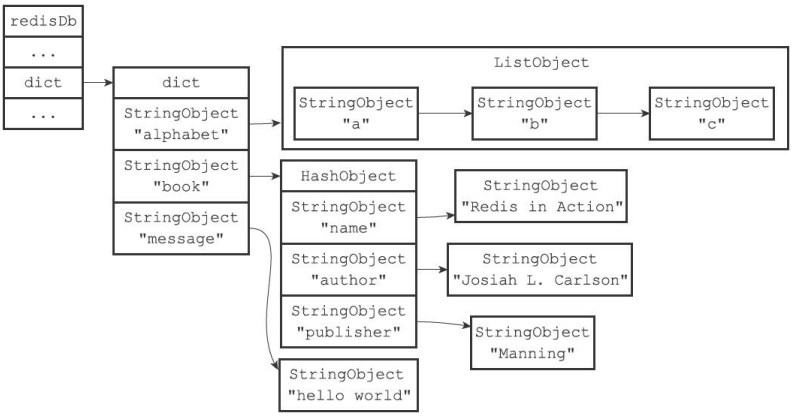
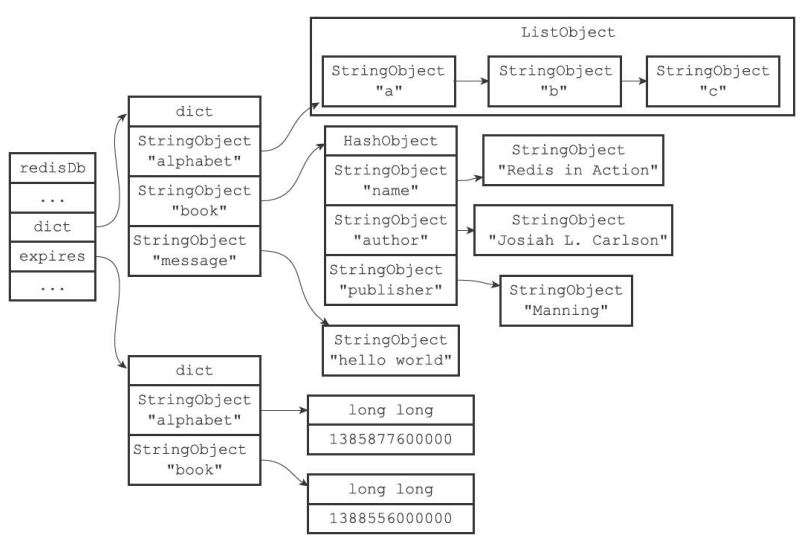
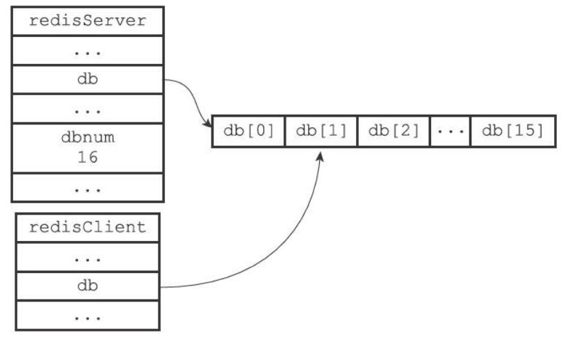
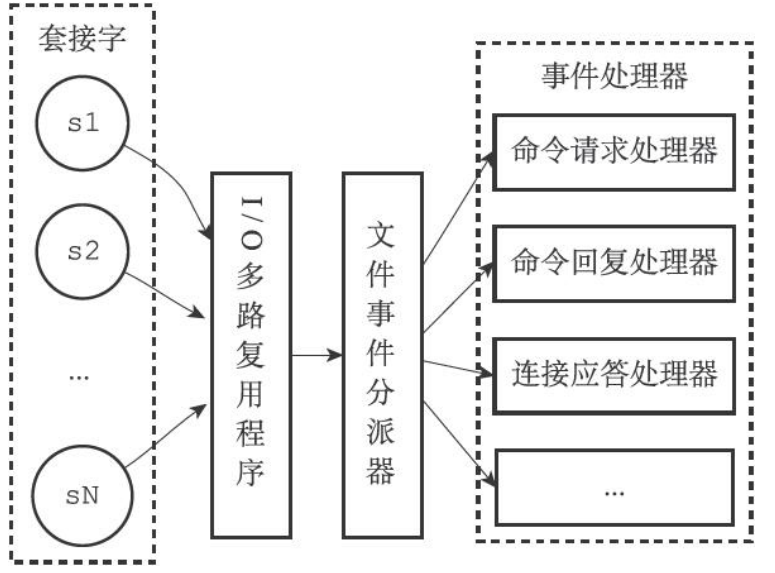
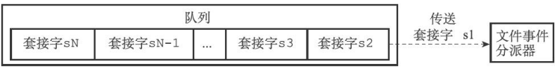
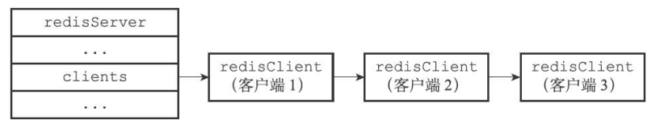
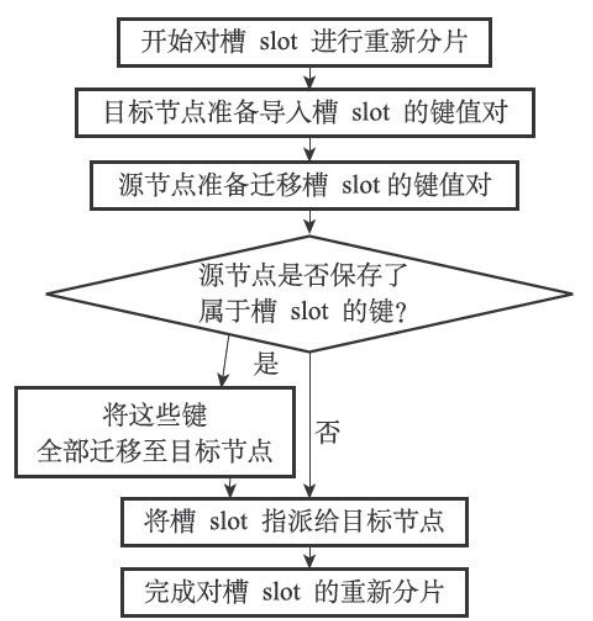

- [Redis](#redis)
	- [Redis数据类型](#redis数据类型)
		- [简单动态字符串(simple dynamic string SDS)](#简单动态字符串simple-dynamic-string-sds)
			- [C字符串与SDS的对比](#c字符串与sds的对比)
		- [链表](#链表)
		- [字典](#字典)
			- [哈希表](#哈希表)
			- [字典实现](#字典实现)
			- [rehash](#rehash)
			- [渐进式rehash](#渐进式rehash)
		- [跳表](#跳表)
		- [整数集合](#整数集合)
		- [压缩列表](#压缩列表)
		- [对象](#对象)
	- [数据库](#数据库)
		- [过期删除策略:](#过期删除策略)
		- [内存淘汰策略](#内存淘汰策略)
	- [持久化](#持久化)
			- [RDB持久化](#rdb持久化)
			- [AOF持久化](#aof持久化)
	- [事件](#事件)
		- [文件事件](#文件事件)
			- [文件事件处理器](#文件事件处理器)
		- [时间事件](#时间事件)
	- [客户端](#客户端)
	- [服务端](#服务端)
		- [命令执行器](#命令执行器)
	- [复制](#复制)
	- [Sentinel哨兵](#sentinel哨兵)
	- [集群](#集群)
	- [订阅与发布](#订阅与发布)
	- [事务](#事务)
	- [排序](#排序)
- [问答](#问答)
	- [Redis为什么这么快](#redis为什么这么快)
	- [Redis集群会有写操作丢失吗](#redis集群会有写操作丢失吗)
	- [Redis集群最大节点个数是多少](#redis集群最大节点个数是多少)
	- [如何使用Redis实现分布式锁](#如何使用redis实现分布式锁)
	- [如何使用Redis实现异步队列](#如何使用redis实现异步队列)
	- [缓存异常](#缓存异常)
	- [如何保证缓存与数据库双写的数据一致性](#如何保证缓存与数据库双写的数据一致性)
		- [为什么是删除缓存而不是更新缓存](#为什么是删除缓存而不是更新缓存)
		- [仍可能发生的缓存不一致问题](#仍可能发生的缓存不一致问题)
	- [假如Redis中有1亿个key，其中10万个key是以某个固定的已知前缀开头的，如何将它们全部找出来](#假如redis中有1亿个key其中10万个key是以某个固定的已知前缀开头的如何将它们全部找出来)


#   Redis
##  Redis数据类型
|	数据类型		|	应用场景	|
|	:---:			|	:---:		|
|	字符串STRING	|	做简单的键值对缓存	|	
|	列表LIST		|	存储一些列表型的数据结构，类似粉丝列表、评论列表之类的数据	|
|	集合SET			|	交集、并集、差集的操作	|
|	散列表HASH		|	结构化的数据，比如一个对象	|
|	有序集合ZSET	|	去重且排序，可以获取排名前几的用户	|

###  简单动态字符串(simple dynamic string SDS)
在Redis中，C字符串只会作为字符串字面量用在一些无需对字符串值进行修改的地方，比如打印日志。                
当Redis需要的不仅仅是一个字符串字面量，而是一个可以被修改的字符串值时，Redis就会使用SDS来表示字符串值，比如在Redis的数据库里面，包含字符串值的键值对在底层都是由SDS实现的。            
除了用来保存数据库中的字符串值之外，SDS还被用作缓冲区:AOF模块中的AOF缓冲区，以及客户端状态中的输入缓冲区。           

```
struct sdshdr{              
	int     len;        //记录buf数组中已经使用的字节数，由SDS的API在执行时自动更新         
	int     free;       //记录buf数组中未使用的字节数           
	char    buf[];      //字节数组，保存字符串，最后一个字节保存'\0'且不计入len中          
};      
```
#### C字符串与SDS的对比

获取C字符串的长度需要进行一次遍历，时间复杂度为O(N)，而SDS可以通过len变量就可以获取长度，时间复杂度为O(1)。         
C字符串未分配足够多的内存时，容易发生缓冲区溢出，而当SDS的API对SDS进行修改时会检查空间是否足够，如果不够则会将SDS扩展至所需的大小后再去修改，不会发生缓冲溢出的问题。           
使用空间预分配与惰性空间释放两种优化策略，减少了SDS因为长度变化而引起的频繁内存分配的问题。                
C字符串以'\0'作为结束符，如果数据中含有'\0'则会被截断，而所有的SDS API都会以处理二进制的方式来处理数据，不会对数据有任何限制。    
SDS兼容部分C字符串函数。        

###  链表
Redis使用链表作为链表键的底层实现之一。当一个列表键包含了数量比较多的元素，又或者列表中包含的元素都是比较长的字符串时，Redis就会使用链表作为列表键的底层实现。
除了链表键之外，发布与订阅、慢查询、监视器等功能也用到了链表，Redis服务器本身还使用链表来保存多个客户端的状态信息，以及使用链表来构建客户端输出缓冲区。
```
struct listNode{				
	struct listNode *prev;		//前置结点			
	struct listNode *next;		//后置结点			
	void *value;				//结点的值			
};
```


```
struct list{
	listNode *head;							//链表头
	listNode *tail;							//链表尾
	unsigned long len;						//链表中节点的数目
	void *(*dup)(void *ptr);				//节点复制函数
	void (*free)(void *ptr);				//节点释放函数
	int (*match)(void *ptr, void *key);		//节点对比函数
};
```
            
特点:              
+	双端，prev指针与next指针
+	无环
+	头指针与尾指针
+	链表长度
+	多态
                         
### 字典
字典在Redis中的应用相当广泛，比如Redis的数据库就是使用字典来作为底层实现的，对数据库的CURD(增、改、查、删)操作也是构建在对字典的操作之上的。                            
字典还是哈希键的底层实现之一，当一个哈希键包含的键值对比较多，又或者键值对中的元素都是比较长的字符串时，Redis就会使用字典作为哈希键的底层实现。                   
#### 哈希表
```
struct dictht{
	dictEntry	**table;		//哈希表数组
	unsigned long size;			//哈希表大小
	unsigned long sizemask;		//哈希表大小掩码，用于计算索引值，总是等于size-1
	unsigned long used;			//哈希表已有节点的数目
};
```
                   

```
struct dictEntry{
	void *key;					//键
	union{				
		void *val;
		uint64_t u64;
		int64_t s64;
	}v;							//值
	struct dictEntry *next;		//链地址法解决哈希冲突，连接哈希值相同的键值对
};
```


#### 字典实现
```
struct dictType {
	uint64_t (*hashFunction)(const void *key);										//计算哈希值的函数，使用键值对中的键作为参数
	void *(*keyDup)(void *privdata, const void *key);								//复制键的函数
	void *(*valDup)(void *privdata, const void *obj);								//复制值的函数
	int (*keyCompare)(void *privdata, const void *key1, const void *key2);			//对比键的函数
	void (*keyDestructor)(void *privdata, void *key);								//销毁键的函数
	void (*valDestructor)(void *privdata, void *obj);								//销毁值的函数
};

typedef struct dict {
	dictType *type;				//保存了一系列对类型特定键值对进行操作的函数
	void *privdata;				//保存了需要传给那些类型特定函数的可选参数
	dictht ht[2];				//两个哈希表，一般只使用ht[0]，ht[1]只会在对ht[0]进行rehash时使用
	long rehashidx;				//rehash索引，记录了rehash目前的进度，当rehash不在进行时值为-1 
};
```

计算哈希值与索引值的方法如下:
```
hash = dict->type->hashFunction(key);		//使用字典设置的哈希函数，计算key的哈希值			
index = hash & dict->ht[x].sizemask			//使用哈希表的sizemask与哈希值计算出索引值，根据情况不同ht[x]可以是ht[0]或者ht[1]		
```
#### rehash
随着操作的不断进行，哈希表的键值对会逐渐的增多或者减少，为了让哈希表的负载因子维持在一个合理的范围之内，当哈希表保存的键值对数目太多或者太少时，需要对哈希表进行扩展或收缩。         
当服务器
+	没有执行BGSAVE或者BGREWRITEAOF命令且负载因子大于等于1
+	正在执行BGSAVE或者BGREWRITEAOF命令且负载因子大于等于5
+	负载因子小于0.1							

时，会自动开始对哈希表进行扩展或收缩操作，其中负载因子通过
```
load_factor = ht[0].used / ht[0].size
```
计算得出。             
1、为字典的ht[1]哈希表分配空间                
+	如果执行的是扩展操作，ht[1]的大小为第一个大于等于ht[0].used*2的2^n                   
+	如果执行的是收缩操作，ht[1]的大小为第一个大于等于ht[0].used的2^n                        

2、将保存在ht[0]中的键值对rehash到ht[1]上:重新计算key的哈希值与索引值，然后将键值对放置到ht[1]的哈希表上。                      
3、当ht[0]包含的所有键值对都迁移到了ht[1]之后，释放ht[0]，将ht[1]设置为ht[0]，并在ht[1]新创建一个空白哈希表。        
#### 渐进式rehash
为了避免rehash数据过多对服务器性能造成影响，分多次、渐进式地将ht[0]中地键值对rehash到ht[1]。                       
1、为字典的ht[1]哈希表分配空间             
2、在字典中维护一个索引计数器rehashidx，将其置为0，表示rehash开始                  
3、rehash期间，每次对字典执行CURD(Create、Update、Retrieve、Delete)操作时，会顺带将ht[0]哈希表在rehashidx索引上的所有键值对rehash到ht[1]，当完成后将rehashidx加一           
4、随着字典操作的不断执行，ht[0]上的键值对全部被rehash到ht[1]，将rehashidx置-1，表示rehash完成              
在渐进式rehash的过程中，字典会同时使用ht[0]与ht[1]两张哈希表，先在ht[0]中查找，找不到后再去ht[1]中查找。插入操作只会将键值对保存到ht[1]中。

### 跳表
跳表是一种有序的数据结构，它通过在每个节点中维持多个指向其他节点的指针，从而达到快速访问节点的目的。                   
跳表支持平均O(logN)，最坏O(N)复杂度的查找，还可以通过顺序性操作来批量处理节点。大部分情况下，跳表的效率可以和平衡树相媲美，而且跳表的实现比平衡树更简单，所以不少程序使用跳表来代替平衡树。      
Redis使用跳表作为有序集合键的底层实现之一。如果一个有序集合包含的元素数量比较多，又或者有序集合中元素的成员是比较长的字符串时，Redis就会使用跳表来作为有序集合键的底层实现。跳表在Redis中只有两个地方会用到，除了有序集合键，还被用在集群节点中的内部数据结构。                             

```
struct zskiplistNode{
	struct zskiplistLevel{						//层
		struct zskiplistNode *forward;			//前进指针
		unsigned int span;						//跨度
	} level[];
	struct zskiplistNode *backward;				//后退指针
	double score;								//分值
	robj *obj;									//成员对象
};

struct zskiplist{
	struct skiplistNode *header, *tail;		//表头节点与表尾节点
	unsigned long length;					//表中节点的数目
	int level;								//表中层数最大的节点的层数，表头节点的层高不计算在内
};
```
1、跳表节点的level数组可以包含多个元素，每个元素都包含一个指向其他节点的指针，程序可以通过这些层来加快访问其他节点的速度，一般层数越多，访问其他节点的速度就越快。                 
2、每层都有一个指向表尾方向的前进指针，用于从表头向表尾方向访问节点。                      
3、层的跨度用于记录两个节点之间的距离，用来计算排位:在查找某个节点的过程中，将沿途访问的所有层的跨度累计起来，得到的结果就是目标节点在跳表中的排位。                  
4、节点的后退指针用于从表尾向表头方向访问节点，每次只能后退至前一个节点。                    
5、跳表中所有节点都按分值从小到大来排序，成员对象指向一个保存着SDS值的字符串对象。在同一个跳表中，各个节点保存的成员对象必须是唯一的，但是分值可以是相同的。                    
6、使用zskiplist来管理跳表节点，可以快速访问表头节点与表尾节点，或者快速获取跳表节点的数目。                 

### 整数集合
整数集合是集合键的底层实现之一，当一个集合只包含整数值元素，并且这个集合的元素数量不多时，Redis就会使用整数集合作为集合键的底层实现。          

```
struct intset{
	uint32_t encoding;		//编码方式
	uint32_t length;		//集合包含的元素数量
	int8_t contents[];		//保存元素的数组
};
```
contents数组是整数集合的底层实现:整数集合的每个元素都是contents数组的一个数组项，各个项在数组中按值的大小从小到大有序地排序，并且数组中不包含任何重复项。length记录了整数集合包含的元素数量。encoding决定了contents数组的真正类型，int16_t,int32_t,int64_t。				            
每当添加类型比整数集合中所有元素的类型都要长的元素时，整数集合需要先进行升级才能添加新元素。升级就是提升所有元素的类型大小的同时保持底层数组的有序。升级在提升了数组的灵活性(可以存储多种类型的数据)的同时也最大限度地节约了内存。          

### 压缩列表
压缩列表是列表键和哈希键的底层实现之一。当一个列表键只包含少量列表项，并且每个列表项要么就是小整数值，要么就是长度比较短的字符串，那么Redis就会使用压缩列表来做列表键的底层实现。当一个哈希键只包含少量键值对，比且每个键值对的键和值要么就是小整数值，要么就是长度比较短的字符串，那么Redis就会使用压缩列表来做哈希键的底层实现。


previous_entry_length属性记录了压缩列表前一个节点的长度，可以通过其从表尾向表头遍历，小于254字节时此属性为1字节，大于等于254字节时此属性为5字节。encoding属性记录了节点的content属性所保存的数据类型以及长度。content属性负责保存节点的值。      
压缩链表可能低概率遇到连锁更新的问题:在压缩链表中所有previous_entry_length属性都为1字节的情况下，当往表头插入一个大于等于254字节的节点时，会使得下一个节点的previous_entry_length属性扩展为5字节，如果这使得这个节点长度大于等于254字节，那么之后节点的previous_entry_length属性也需要扩展，就会形成连锁反应。

### 对象
Redis并没有直接上述数据结构来实现键值对数据库，而是基于这些数据结构创建了一个对象系统，这个系统包含字符串对象、列表对象、哈希对象、集合对象和有序集合对象这五种类型的对象，每种对象都用到了至少一种数据结构。
```
struct redisObiect{
	unsigned type:4;			//类型
	unsigned encoding:4;		//编码，即是该对象使用了什么数据结构作为对象的底层实现
	void *ptr;					//指向底层实现数据结构的指针
	int refcount;				//引用计数
	unsigned lru:22;			
	...
};
```

Redis使用对象来表示数据库中的键和值，每次当我们在Redis的数据库中新创建一个键值对时，我们至少会创建两个对象，一个对象用作键值对的键(总是一个字符串对象)，另一个对象用作键值对的值(可以为五种对象其中一种)。列表键意味着键为字符串对象，值为列表对象。	
	
对象通过使用不同的编码来优化在某一场景下的效率。       	    
对象通过引用计数来实现自动释放对象并进行内存回收。还可以通过引用计数来实现共享对象，节约内存:让键的值指针指向一个现有的值对象，并且引用计数加一。
lru属性记录了对象最后一次被访问的时间。


## 数据库
```
struct redisDb{
	dict *dict;			//数据库键空间，保存着数据库中的所有键值对
	dict *expires;		//过期字典，键为指向键空间中某个键值对的指针，值为过期时间
	...
};

struct redisServer{
	redisDb *db;		//保存着服务器中的所有数据库
	int dbnum;			//服务器中数据库的数目
	...
};

struct redisClient{
	redisDb *db;		//客户端当前正在使用的数据库
	...
};
```

实际上图中过期字典的键与键空间的键都指向同一个键对象。


### 过期删除策略:
+	定时删除，在设置键的过期时间的同时，创建一个定时器，通过定时器来执行对键的删除操作。对内存友好(可以保证过期键尽快地删除并释放内存)，但是对CPU时间不友好(过期键比较多的情况下，删除过期键会占用大量CPU时间，影响服务器响应时间与吞吐量)。
+	惰性删除，每次从键空间获取键时，检查取得的键是否过期，如果过期则执行删除操作。对CPU时间友好(只在取出键的时候才进行过期检查，保证了删除过期键的操作只会在非做不可的情况下进行，而且只会删除当前处理的键)，但是对内存不友好(如果一个键已经过期，但是又一直没有被取出，那这个键永远不会被删除与释放内存)。
+	定期删除，每隔一段时间，从一定数量的数据库中取出一定数量的随机键进行检查，并删除其中的过期键，下次开始时会接着上一次的进度进行，直到所有数据库全部检查完毕，之后开启新一轮检查。删多少过期键以及检查多少数据库由算法决定。是上述两种方法的一个折中，难点在于确定删除操作执行的时长和频率。        
Redis实际使用的是惰性删除与定期删除。           
RDB持久化生成RDB文件时，已过期的键不会保存到RDB文件中。载入RDB文件时，会对键进行检查，忽略掉已过期的键。                   
AOF持久化生成AOF文件时，已过期的键会写入到AOF文件中，当过期键被删除时，会向AOF文件追加一条DEL命令。重写AOF文件时与生成RDB文件类似，会进行检查，已过期的键不会保存到重写后的AOF文件中。                  
复制模式下，从服务器的过期删除动作由主服务器控制，即从服务器不会主动删除过期键。              

### 内存淘汰策略
当内存使用达到最大限制时(maxmemory)，Redis会根据配置选择内存淘汰策略。
1、volatile-lru:从已设置过期时间的数据集中挑选最近最少使用的数据淘汰
2、volatile-ttl:从已设置过期时间的数据集中挑选剩余时间最短的数据淘汰
3、volatile-random:从已设置过期时间的数据集中任意选择数据淘汰
4、volatile-lfu:从已设置过期时间的数据集中挑选使用频率最低的数据淘汰
5、allkeys-lru:从数据集中挑选最近最少使用的数据淘汰
6、allkeys-lfu:从数据集中挑选使用频率最低的数据淘汰
7、allkeys-random:从数据集中任意选择数据淘汰
8、no-enviction:禁止驱逐数据，也是默认策略


## 持久化
RDB持久化与AOF持久化。如果服务器开启了AOF持久化功能，则优先使用AOF文件还原，只有在AOF持久化功能关闭时，服务器才会使用RDB文件来还原。
#### RDB持久化
RDB文件用于保存和还原Redis服务器所有数据库中的所有键值对数据(记录的是键值对)。
服务器会周期性的检查，在一段时间之内对数据库进行了一定量的修改，就会开启一个子进程进行RDB持久化。不同时间段对应的修改数目阈值不一样。
优点:
+ RDB文件是紧凑的二进制文件，比较适合做冷备、全量复制的场景
+ 相对于AOF持久化，使用RDB文件来重启和回复Redis进程更加快速
缺点:
+ 每隔一段时间才会进行一次持久化，一旦在持久化之前出现服务器故障，两次持久化之间的数据全部丢失
#### AOF持久化
AOF持久化是通过保存所有修改数据库的写命令来记录数据库状态的(记录的是命令)。              
由于AOF文件记录的是写命令，随着运行时间的增长，AOF文件会越来越大。AOF文件重写功能解决了AOF文件体积膨胀的问题，通过创建一个新的与原AOF文件保存的数据库状态相同的AOF文件，来减少冗余命令、减小体积。               
AOF文件重写是通过读取服务器当前的数据库状态来实现的，首先从数据库中读取键现在的值，然后用一条命令去记录键值对，来代替之前记录这个键值对的多条命令。因为新AOF文件只包含还原当前数据库状态所必要的命令，所以新AOF文件不会浪费任何硬盘空间。                          
为了防止子进程重写期间，新命令对现有数据库状态进行修改，使得服务器当前的数据库状态和重写后的AOF文件保存的数据库状态不一致，Redis设置了一个AOF重写缓冲区，每当服务器执行完一个写命令后，它会将这个写命令发送给AOF缓冲区(会定期被写入和同步到现有的AOF文件)与AOF重写缓冲区(从创建子进程开始，服务器所执行的所有写命令都会被记录到AOF重写缓冲区中，并最终写入到新AOF文件中)。当子进程完成AOF重写工作之后，它会向父进程发送一个信号，父进程的信号处理函数就将AOF重写缓冲区中的所有内容写入到新AOF文件中并对新AOF文件改名，覆盖现有的AOF文件。
优点:
+ 可以选择不同的同步策略，默认一秒同步一次到AOF文件
+ AOF文件以append-only模式写入，写入性能较高
缺点:
+ 对于相同数量的数据集而言，AOF文件通常要大于RDB文件，并且根据同步策略的不同，AOF在运行效率上往往会慢于RDB

## 事件
+	文件事件:服务器对与客户端连接的套接字操作的抽象。
+	时间事件:服务器对定时操作的抽象。
### 文件事件
#### 文件事件处理器
Redis基于Reactor模式开发了网络事件处理器:文件事件处理器。文件事件处理器使用I/O多路复用程序来同时监听多个套接字，并根据套接字目前执行的任务来为套接字关联不同的事件处理器。当被监听的套接字准备好执行accept、read、write、close等操作时，关联的与之对应的事件处理器就会来处理这些事件。

通过队列，以有序、同步、每次一个套接字地向事件分派器传送套接字。


### 时间事件
将所有的时间事件都放在一个无序链表中，每当时间事件执行器运行时，它就遍历整个链表，查找所有已到达的时间事件，并调用相应的事件处理器。


## 客户端
```
struct redisClient{
	int fd;								//客户端正在使用的套接字描述符
	robj *name;							//客户端名字
	int flags;							//记录了客户端的角色以及客户端目前所处的状态
	sds querybuf;						//输入缓冲区，记录了客户端发送的命令请求，缓冲区大小不能超过1GB
	robj **argv;						//argv[0]为要执行的命令，之后的为传给命令的参数
	int argc;							//argc为argv的长度
	struct redisCommand *cmd;			//指向argv[0]中命令的实现函数
	char buf[REDIS_REPLY_CHUNK_BYTES];	//固定大小输出缓冲区，用于保存长度较小的回复
	int bufpos;							//记录了buf数组中已使用的字节数目
	list *reply;						//可变大小输出缓冲区，当buf数组已经用完或者回复太大时使用。使用链表连接多个字符串对象
	int authenticated;					//记录客户端是否通过身份验证
	time_t ctime;						//记录了创建客户端的时间
	time_t lastinteraction;				//记录了客户端与服务器最后一次进行互动的时间
	time_t obuf_soft_limit_reached_time;//记录了输出缓冲区第一次到达软性限制的时间，如果输出缓冲区的大小一直超出软性限制并达到一定的时间，服务器将关闭客户端
	...
};
```
对于每个与服务器进行连接的客户端，服务器都为这些客户端建立了相应的redisClient结构，保存了客户端当前的状态信息以及需要的数据结构。                 
Redis服务器状态结构的clients属性是一个链表，保存了所有与服务器连接的客户端的状态结构。          



## 服务端
```
struct redisServer{
	list *clients;											//保存了所有客户端状态的链表
	redisClient *lua_client;								//Lua脚本的伪客户端
	time_t unixtime;										//保存了秒级精度的当前UNIX时间戳
	long long mstime;										//保存了毫秒级精度的当前UNIX时间戳
	unsigned lruclock:22;									//用于计算键的空转时长
	long long ops_sec_last_sample_time;						//上一次进行抽样的时间	
	long long ops_sec_last_sample_ops;						//上一次抽样服务器已执行的命令数
	long long ops_sec_samples[REDIS_OPS_SEC_SAMPLES];		//数组中记录着抽样的结果
	int ops_sec_idx;										//数组的索引，每次抽样后加一
	size_t stat_peak_memory;								//已使用内存峰值
	int shutdown_asap;										//关闭服务器的标识
	int aof_rewrite_scheduled;								//当服务器执行BGSAVE时，会推迟BGREWRITEAOF命令的执行直到BGSAVE完毕
	pid_t rdb_child_pid;									//BGSAVE的子进程ID
	pid_t aof_child_pid;									//BGREWRITEAOF的子进程ID
	int cronloops;											//serverCron函数的运行次数计数器
	...
};
```
当客户端与服务端之间的连接套接字因为客户端的写入而变得可读时，服务端将调用命令请求处理器来执行以下操作:                
1、读取套接字中协议格式的命令请求，将其保存到客户端状态的输入缓冲区中。                  
2、对输入缓冲区中的命令请求进行分析，提取出命令请求中包含的命令参数以及命令参数的个数，分别保存到客户端状态的argv属性与argc属性里。                 
3、调用命令执行器，执行客户端指定的命令。              

### 命令执行器
1、查找命令实现，根据客户端状态的argv[0]参数在命令表中查找参数所指定的命令，并将找到的命令保存到客户端状态的cmd属性里。
2、执行预备操作，确保命令可以正确、顺利地被执行:
+ 检查客户端状态地cmd指针是否指向NULL，若是则说明用户输入的命令找不到对应的实现
+ 根据cmd属性指向的redisCommand结构，检查命令请求所给定的参数个数是否正确
+ 检查客户端是否已经通过了身份验证，未通过身份验证的客户端只能执行AUTH
+ 如果服务器打开了maxmemory功能，检查服务器的内存占用情况并在有需要时进行内存的回收
+ 如果服务器上一次执行BGSAVE出错且打开了stop-writes-on-bgsave-error功能，服务器将拒绝执行写命令
+ 如果客户端当前正在用SUBSCRIBE命令订阅频道或PSUBSCRIBE命令订阅模式，那么服务器只会执行客户端发来的SUBSCRIBE、PSUBSCRIBE、UNSUBSCRIBE、PUNSUBSCRIBE四个命令
+ 如果服务器正在进行数据载入，那么客户端发送的命令必须带有1标识才会被服务器执行
+ 如果服务器因为执行Lua脚本而超时并进入阻塞，那么服务器只会执行客户端发来的SHUTDOWN nosave和SCRIPT KILL命令
+ 如果客户端正在执行事务，那么服务器只会执行客户端发来的EXEC、DISCARD、MULTI、WATCH命令，其他命令会被放进事务队列中
+ 如果服务器打开了监视器功能，那么服务器会将要执行的命令和参数等信息发送给监视器。             
当完成了以上预备操作之后，服务器就可以开始真正执行命令了。
3、调用命令的实现函数，通过cmd属性与argv、argc属性执行命令，产生的回复会被保存在客户端状态的buf属性和reply属性里面，并将回复返回给客户端。
4、执行后续工作:
+ 如果服务器开启了慢查询日志功能，那么慢查询日志模块会检查是否需要为刚刚执行完的命令请求添加一条新的慢查询日志
+ 根据刚刚执行命令所耗费的时长，更新被执行命令的redisCommand结构的milliseconds属性，并将命令的redisCommand结构的calls计数器的值加一
+ 如果服务器开启了AOF持久化功能，那么AOF持久化模块会将刚刚执行的命令请求写入到AOF缓冲区里面
+ 如果有其他从服务器正在复制当前这个服务器，那么服务器会将刚刚执行的命令传播给所有从服务器


## 复制
Redis的复制分为同步和命令传播两个操作:
1、同步操作用于将从服务器的数据库状态更新至主服务器当前所处的数据库状态。
+ 当从服务器要求同步时，从服务器向主服务器发送SYNC命令
+ 收到SYNC命令的主服务器执行BGSAVE命令，在后台生成RDB文件，并使用一个缓冲区记录从现在开始执行的所有写命令
+ 当主服务器的BGSAVE命令执行完毕时，主服务器会将RDB文件发送给从服务器，从服务器接受并载入
+ 主服务器将缓冲区里的写命令全部发送给从服务器，从服务器执行这些写命令
2、命令传播操作则用于在主服务器的数据库状态被修改导致主从服务器的数据库状态出现不一致时，让主从服务器的数据库重新回到一致状态。主服务器会将自己执行的写命令也即是造成主从服务器不一致的那条写命令发送给从服务器执行。

为了解决断线复制使用SYNC命令的低效问题，使用PSYNC代替了SYNC。PSYNC支持完整重同步(与SYNC一致)与部分重同步(断开重连后，主服务器只将连接断开期间执行的写命令发送给从服务器)。
部分重同步由以下三个部分组成:
+ 主服务器的复制积压缓冲区，一个固定长度的FIFO队列，当主服务器进行命令传播时，不仅会把写命令发送给所有从服务器，还会把写命令入队到复制积压缓冲区里。
+ 服务器的复制偏移量，主服务器每次向从服务器传播N个字节时，主服务器的复制偏移量加N，从服务器每次收到主服务器传播的N个字节时，从服务器的复制偏移量加N。重连时，从服务器会发送自己的复制偏移量，如果偏移量之后的数据还存在于复制积压缓冲区里，则执行部分重同步，使得主从服务器的复制偏移量相等，否则执行完整重同步。
+ 服务器的运行ID，当从服务器执行初次复制时，主服务器会将自己的运行ID发送给从服务器，从服务器会保存这个ID。断线重连后，通过保存的ID来判断是否为同一个主服务器，若是，执行部分重同步，若不是，执行完整重同步。

在命令传播阶段，从服务器会以每秒一次的频率向主服务器发送心跳包，心跳包中包含复制偏移量。
+ 检测主从服务器的网络连接状态
+ 检测命令丢失
+ 辅助实现min-slaves选项


## Sentinel哨兵
由一个或多个哨兵实例组成的哨兵系统可以监视任意多个主服务器，以及这些主服务器下的所有从服务器。当被监视的主服务器下线时，自动将下线主服务器属下的某个从服务器升级为新的主服务器。
哨兵只是一个运行在特殊模式下的Redis服务器，为每个要被监视的主服务器和从服务器创建相应的实例结构，并创建连接向主/从服务器的命令连接(用于向主服务器发送命令请求)和订阅连接(用于接受指定频道的消息)。              
哨兵之间只创建命令连接，监视同一主服务器和从服务器的多个哨兵会通过命令连接进行通讯。          
哨兵以每秒一次的频率向实例发送PING，如果实例在指定时长中连续返回无效回复时，哨兵会将这个实例判断为主观下线，同时询问同样监视这个主服务器的哨兵是否同意该服务器进入主观下线。当收集到足够多的主观下线投票之后，会将主服务器判断为客观下线。多个哨兵进行协商选举出一个领头的哨兵，由它进行故障转移。         
故障转移:
1、在已下线主服务器属下的所有从服务器中，挑选出一个状态良好、数据完整的从服务器，将其转换为主服务器。
2、让已下线主服务器属下的所有从服务器改为复制新的主服务器。
3、当旧的主服务器重新上线时，将其设置为新的主服务器的从服务器。


## 集群
一个Redis集群通常由多个运行在集群模式下的节点组成，从节点用于复制主节点，并在主节点下线时代替主节点。                          
Redis集群通过分片的方式来保存数据库中的键值对:集群的整个数据库被分为16384(2^14)个槽，数据库中的每个键都属于这16384个槽中的一个，一个槽中含有多个键值对。只有当所有的槽都有节点在处理时，集群才处于上线状态。                 
节点之间会传递自己所管理的槽的信息，当客户端向节点发送数据库键有关的命令时，接受命令的节点会计算出命令要处理的数据库键属于哪个槽以及这个槽是否指派给了自己，如果指派给了当前节点，那么节点直接执行，否则，会向客户端返回一个MOVED错误，带有正确节点的信息，引导客户端重定向至正确的节点。           

重新分片后，会将指派消息通过消息发送至整个集群。                       
重新分片期间，源节点向目标节点迁移一个槽的过程中，可能会出现被迁移槽的一部分键值对保存在源节点里，另一部分保存在目标节点里。当客户端向源节点发送一个与数据库键有关的命令，并且命令要处理的数据库键恰好就属于正在被迁移的槽时，源节点会先在自己的数据库中查找指定的键，如果找到就直接执行命令，否则，会向客户端返回一个ASK错误，引导客户端转向正在导入槽的目标节点。                   
MOVED错误可以看作永久重定向，ASK错误可以看作临时重定向。                    
集群中的每个节点都会定期的向集群中的其他节点发送PING消息来检测对方是否在线，如果对方没有在规定的时间内返回PONG消息，那么发送PING消息的节点就将其标记为疑似下线。集群中的各个节点会通过互相发送消息的方式来交换集群中各个节点的状态信息。当半数以上的主节点都将某个主节点报告为疑似下线，那么这个主节点将被标记为已下线，已下线的消息也会被广播到集群中。                       
集群故障转移:
1、在下线主节点的从节点中挑选出一个成为新的主节点
2、新主节点会撤销所有对已下线主节点的槽指派，并将这些槽全部指派给自己
3、新主节点向集群广播一条PONG消息，让集群中其他节点知道这个节点成为了主节点
4、新主节点开始接受和自己负责处理的槽有关的命令请求
节点消息主要有五种:
+ MEET:请求接收者加入到发送者当前所处的集群中
+ PING:集群中每个节点每个一秒就会从已知节点列表中随机挑出五个节点，然后对其中最长时间没有发送过PING消息的节点发送PING消息，检测其是否在线
+ PONG:接受到MEET或者PING消息后会返回一条PONG消息，也可以主动广播PONG消息来让其他节点刷新对这个节点的认识
+ FAIL:当一个主节点判断另一主节点已下线时，就会广播一条关于已下线节点的FAIL消息，所有接收到这条消息的节点都会立即将下线节点标记为已下线
+ PUBLISH:当节点接收到一个PUBLISH命令时，节点会执行这个命令并向集群中广播
集群中各个节点通过Gossip协议来交换各自关于不同节点的状态信息，Gossip协议由MEET、PING、PONG三种消息实现。
Gossip协议是一个带冗余的容错算法，是一个最终一致性算法，具有去中心化的特点:在一个有界网络中，每个节点都随机地与其他节点通讯，经过一番杂乱无章的通讯，最终所有节点的状态都会达成一致。


## 订阅与发布
服务器状态在pubsub_channels字典保存了所有频道的订阅关系:SUBSCRIBE命令负责将客户端和被订阅的频道关联到这个字典里面，而UNSUBSCRIBE命令则负责解除客户端和被退订频道之间的关联。              
服务器状态在pubsub_patterns链表保存了所有模式的订阅关系:PSUBSCRIBE命令负责将客户端和被订阅的模式记录到这个链表中，而PUNSUBSCRIBE命令则负责移除客户端和被退订模式在链表中的记录。              
PUBLISH命令通过访问pubsub_channels字典来向频道的所有订阅者发送消息，通过访问pubsub_patterns链表来向所有匹配频道的模式的订阅者发送消息。


## 事务
事务提供了一种将多个命令打包，然后一次性、有序地执行的机制。以MULTI开始，以EXEC将事务提交。
EXEC、DISCARD、WATCH、MULTI命令会立即执行，其他的命令会被入队到事务队列中，然后按先进先出的顺序执行。                              
事务在执行过程中不会被中断，当事务队列中的所有命令都被执行完毕之后，事务才会结束。                 
WATCH命令是一个乐观锁，它可以在EXEC命令执行之前，监视任意数量的数据库键，并在EXEC命令执行时，检查被监视的键是否至少有一个已经被修改过了，如果是的话，服务器将拒绝执行事务，并向客户端返回代表事务执行失败的空回复。                    
Redis的事务总是具有ACID中的原子性(不支持事务回滚)、一致性和隔离性，当服务器运行在AOF持久化模式下且appendfsync选项的值为always时，事务也具有持久性。                    


## 排序
SORT命令通过将被排序键包含的元素载入到数组里面，然后对数组进行排序来完成对键进行排序的工作。              
SORT命令的排序操作由快速排序算法实现。                 


# 问答
## Redis为什么这么快
+ 完全基于内存
+ 核心模块(文件事件处理器中的队列的消费)采用单线程(网路IO、LRU的淘汰等采用了多线程)，避免了上下文切换与竞争条件
+ 使用了I/O多路复用，非阻塞IO

## Redis集群会有写操作丢失吗
Redis并不能保证数据的强一致性，可能会丢失写操作

## Redis集群最大节点个数是多少
16384，与哈希槽数目一致

## 如何使用Redis实现分布式锁
Redis是单线程的，可以使用SETNX(set if not exist)命令来实现分布式锁。SETNX:当key不存在时，将key的值设置为value并返回1，若key存在，则直接返回0。使用SETNX来获取锁，DEL来释放锁，通过设置过期时间防止产生死锁。

## 如何使用Redis实现异步队列
+ 使用list保存数据，rpush生产消息，lpop(非阻塞)消费消息，当lpop为空时可以sleep一段时间再检查是否有消息，也可以使用blpop(阻塞)。
+ 可以使用pub/sub发布订阅模式实现一个生产者、多个消费者，但是发布者不确保消息的可靠性，当消费者下线时，会丢失下线期间的消息。

## 缓存异常
缓存雪崩:缓存同一时间大面积失效，后面的请求全部落在数据库上，造成数据库短时间内承受大量请求崩掉。
+ 往Redis存数据时，把每个key的失效时间都加个随机值

缓存穿透:请求缓存和数据库中都没有的数据，所有请求都落在数据库上，造成数据库短时间内承受大量请求崩掉。
+ 使用布隆过滤器
+ 将请求的key的值设为null，缓存有效时间设置短一点，如30s
+ 对key进行检查合法性

缓存击穿:请求缓存中没有但是数据库中有的数据，所有请求都落在数据库上，造成数据库短时间内承受大量请求崩掉。
+ 设置热点数据永不过期
+ 加互斥锁访问

缓存预热:系统刚上线时，缓存中没有数据

缓存降级:访问量剧增时，服务出现问题或者非核心服务影响到核心服务的性能时，对一些数据进行降级。

## 如何保证缓存与数据库双写的数据一致性
如果严格要求一致性就使用读写串行化。如果不是严格要求允许缓存可以稍微跟数据库偶尔有不一致的情况，使用如下方案:
+ 读的时候，先读缓存，缓存没有的话就先读数据库，然后取出数据后放入缓存，同时返回响应。
+ 更新的时候，先更新数据库，然后再删除缓存。
### 为什么是删除缓存而不是更新缓存
懒加载，用到缓存的时候再去加载。
### 仍可能发生的缓存不一致问题
1、先修改数据库再删除缓存，如果删除缓存失败了，那么会导致数据库中是新数据，缓存中是旧数据，数据不一致。
解决方案:先删除缓存再修改数据库，如果数据库修改失败，那么缓存为空，数据库中是旧数据，表现为修改操作失败。
2、修改数据，先删除了缓存，然后准备修改数据库，另一个读请求过来，缓存中未查到，去查询数据库得到旧数据同时更新缓存，最后数据库完成修改，数据不一致。
解决方案:可以用FIFO队列去解决这个问题，使用多个队列，修改数据时根据key做哈希、对队列数取模，分配至队列，如果此时有读请求，先查看缓存中有没有数据，没有再去队列中查看有没有相同的key在更新，如果有则把查询请求也放入队列，等待更新完成后再查询。

## 假如Redis中有1亿个key，其中10万个key是以某个固定的已知前缀开头的，如何将它们全部找出来
使用keys指令可以扫出指定模式的key列表
Redis为单线程，keys指令会导致线程阻塞，线上服务会停顿直到指令执行完毕才能恢复。可以使用scan指令，scan指令可以无阻塞的获取指定模式的key列表，但是会有一定的重复率，可以再客户端进行一次去重，整体花费时间长于keys。