- [Redis](#redis)
	- [Redis数据类型](#redis数据类型)
	- [简单动态字符串(simple dynamic string SDS)](#简单动态字符串simple-dynamic-string-sds)
		- [C字符串与SDS的对比](#c字符串与sds的对比)
	- [链表](#链表)
	- [字典](#字典)
		- [哈希表](#哈希表)
		- [字典实现](#字典实现)
		- [rehash](#rehash)
		- [渐进式rehash](#渐进式rehash)
	- [跳表](#跳表)
	- [整数集合](#整数集合)
	- [压缩列表](#压缩列表)
	- [对象](#对象)


#   Redis
##  Redis数据类型
+   字符串
+   列表
+   集合
+   散列表
+   有序集合

##  简单动态字符串(simple dynamic string SDS)
在Redis中，C字符串只会作为字符串字面量用在一些无需对字符串值进行修改的地方，比如打印日志。                
当Redis需要的不仅仅是一个字符串字面量，而是一个可以被修改的字符串值时，Redis就会使用SDS来表示字符串值，比如在Redis的数据库里面，包含字符串值的键值对在底层都是由SDS实现的。            
除了用来保存数据库中的字符串值之外，SDS还被用作缓冲区:AOF模块中的AOF缓冲区，以及客户端状态中的输入缓冲区。           
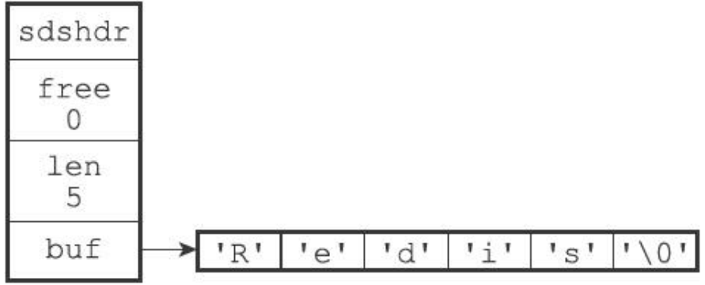
```
struct sdshdr{              
	int     len;        //记录buf数组中已经使用的字节数，由SDS的API在执行时自动更新         
	int     free;       //记录buf数组中未使用的字节数           
	char    buf[];      //字节数组，保存字符串，最后一个字节保存'\0'且不计入len中          
};      
```

### C字符串与SDS的对比
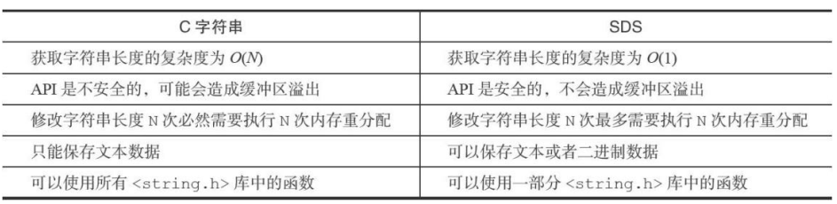
获取C字符串的长度需要进行一次遍历，时间复杂度为O(N)，而SDS可以通过len变量就可以获取长度，时间复杂度为O(1)。         
C字符串未分配足够多的内存时，容易发生缓冲区溢出，而当SDS的API对SDS进行修改时会检查空间是否足够，如果不够则会将SDS扩展至所需的大小后再去修改，不会发生缓冲溢出的问题。           
使用空间预分配与惰性空间释放两种优化策略，减少了SDS因为长度变化而引起的频繁内存分配的问题。                
C字符串以'\0'作为结束符，如果数据中含有'\0'则会被截断，而所有的SDS API都会以处理二进制的方式来处理数据，不会对数据有任何限制。    
SDS兼容部分C字符串函数。        

##  链表
Redis使用链表作为链表键的底层实现之一。当一个列表键包含了数量比较多的元素，又或者列表中包含的元素都是比较长的字符串时，Redis就会使用链表作为列表键的底层实现。
除了链表键之外，发布与订阅、慢查询、监视器等功能也用到了链表，Redis服务器本身还使用链表来保存多个客户端的状态信息，以及使用链表来构建客户端输出缓冲区。
```
struct listNode{				
	struct listNode *prev;		//前置结点			
	struct listNode *next;		//后置结点			
	void *value;				//结点的值			
};
```

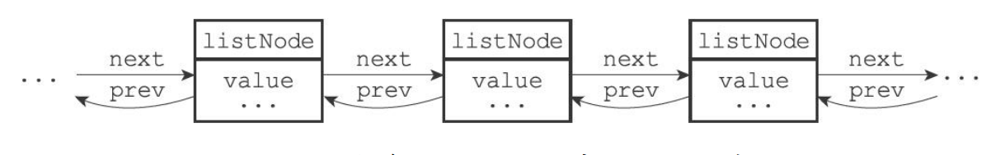
```
struct list{
	listNode *head;							//链表头
	listNode *tail;							//链表尾
	unsigned long len;						//链表中节点的数目
	void *(*dup)(void *ptr);				//节点复制函数
	void (*free)(void *ptr);				//节点释放函数
	int (*match)(void *ptr, void *key);		//节点对比函数
};
```
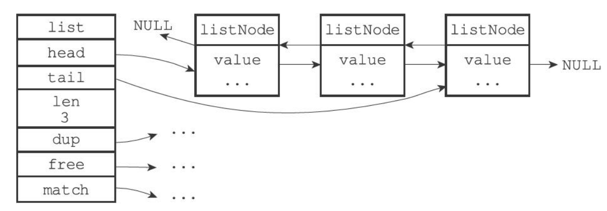            
特点:              
+	双端，prev指针与next指针
+	无环
+	头指针与尾指针
+	链表长度
+	多态
                         
## 字典
字典在Redis中的应用相当广泛，比如Redis的数据库就是使用字典来作为底层实现的，对数据库的CURD(增、改、查、删)操作也是构建在对字典的操作之上的。                            
字典还是哈希键的底层实现之一，当一个哈希键包含的键值对比较多，又或者键值对中的元素都是比较长的字符串时，Redis就会使用字典作为哈希键的底层实现。                   
### 哈希表
```
struct dictht{
	dictEntry	**table;		//哈希表数组
	unsigned long size;			//哈希表大小
	unsigned long sizemask;		//哈希表大小掩码，用于计算索引值，总是等于size-1
	unsigned long used;			//哈希表已有节点的数目
};
```
                   
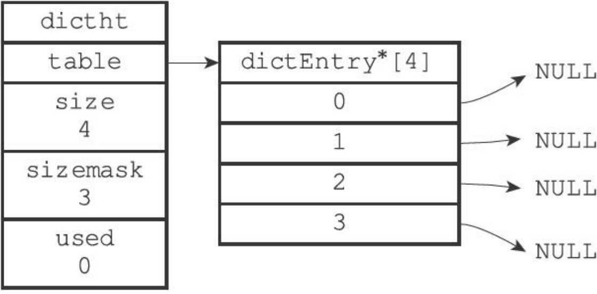
```
struct dictEntry{
	void *key;					//键
	union{				
		void *val;
		uint64_t u64;
		int64_t s64;
	}v;							//值
	struct dictEntry *next;		//链地址法解决哈希冲突，连接哈希值相同的键值对
};
```
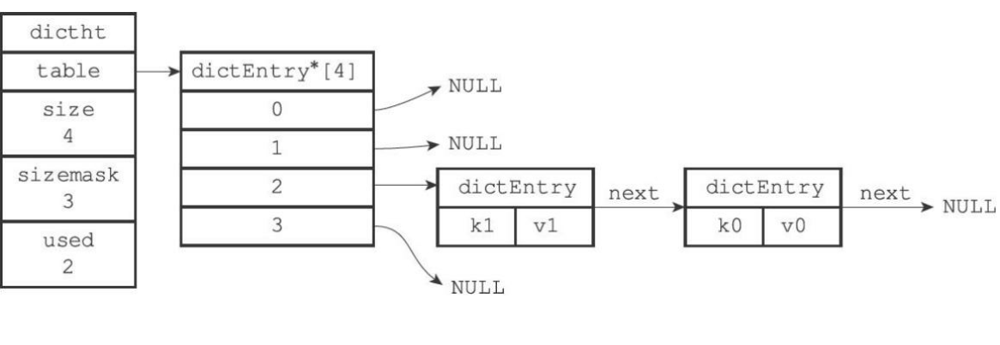

### 字典实现
```
struct dictType {
	uint64_t (*hashFunction)(const void *key);										//计算哈希值的函数，使用键值对中的键作为参数
	void *(*keyDup)(void *privdata, const void *key);								//复制键的函数
	void *(*valDup)(void *privdata, const void *obj);								//复制值的函数
	int (*keyCompare)(void *privdata, const void *key1, const void *key2);			//对比键的函数
	void (*keyDestructor)(void *privdata, void *key);								//销毁键的函数
	void (*valDestructor)(void *privdata, void *obj);								//销毁值的函数
};

typedef struct dict {
	dictType *type;				//保存了一系列对类型特定键值对进行操作的函数
	void *privdata;				//保存了需要传给那些类型特定函数的可选参数
	dictht ht[2];				//两个哈希表，一般只使用ht[0]，ht[1]只会在对ht[0]进行rehash时使用
	long rehashidx;				//rehash索引，记录了rehash目前的进度，当rehash不在进行时值为-1 
};
```
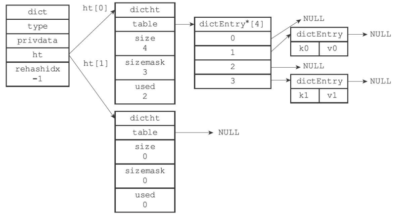
计算哈希值与索引值的方法如下:
```
hash = dict->type->hashFunction(key);		//使用字典设置的哈希函数，计算key的哈希值			
index = hash & dict->ht[x].sizemask			//使用哈希表的sizemask与哈希值计算出索引值，根据情况不同ht[x]可以是ht[0]或者ht[1]		
```
### rehash
随着操作的不断进行，哈希表的键值对会逐渐的增多或者减少，为了让哈希表的负载因子维持在一个合理的范围之内，当哈希表保存的键值对数目太多或者太少时，需要对哈希表进行扩展或收缩。         
当服务器
+	没有执行BGSAVE或者BGREWRITEAOF命令且负载因子大于等于1
+	正在执行BGSAVE或者BGREWRITEAOF命令且负载因子大于等于5
+	负载因子小于0.1							

时，会自动开始对哈希表进行扩展或收缩操作，其中负载因子通过
```
load_factor = ht[0].used / ht[0].size
```
计算得出。             
1、为字典的ht[1]哈希表分配空间                
+	如果执行的是扩展操作，ht[1]的大小为第一个大于等于ht[0].used*2的2^n                   
+	如果执行的是收缩操作，ht[1]的大小为第一个大于等于ht[0].used的2^n                        

2、将保存在ht[0]中的键值对rehash到ht[1]上:重新计算key的哈希值与索引值，然后将键值对放置到ht[1]的哈希表上。                      
3、当ht[0]包含的所有键值对都迁移到了ht[1]之后，释放ht[0]，将ht[1]设置为ht[0]，并在ht[1]新创建一个空白哈希表。        
### 渐进式rehash
为了避免rehash数据过多对服务器性能造成影响，分多次、渐进式地将ht[0]中地键值对rehash到ht[1]。                       
1、为字典的ht[1]哈希表分配空间             
2、在字典中维护一个索引计数器rehashidx，将其置为0，表示rehash开始                  
3、rehash期间，每次对字典执行CURD(Create、Update、Retrieve、Delete)操作时，会顺带将ht[0]哈希表在rehashidx索引上的所有键值对rehash到ht[1]，当完成后将rehashidx加一           
4、随着字典操作的不断执行，ht[0]上的键值对全部被rehash到ht[1]，将rehashidx置-1，表示rehash完成              
在渐进式rehash的过程中，字典会同时使用ht[0]与ht[1]两张哈希表，先在ht[0]中查找，找不到后再去ht[1]中查找。插入操作只会将键值对保存到ht[1]中。

## 跳表
跳表是一种有序的数据结构，它通过在每个节点中维持多个指向其他节点的指针，从而达到快速访问节点的目的。                   
跳表支持平均O(logN)，最坏O(N)复杂度的查找，还可以通过顺序性操作来批量处理节点。大部分情况下，跳表的效率可以和平衡树相媲美，而且跳表的实现比平衡树更简单，所以不少程序使用跳表来代替平衡树。      
Redis使用跳表作为有序集合键的底层实现之一。如果一个有序集合包含的元素数量比较多，又或者有序集合中元素的成员是比较长的字符串时，Redis就会使用跳表来作为有序集合键的底层实现。跳表在Redis中只有两个地方会用到，除了有序集合键，还被用在集群节点中的内部数据结构。                             
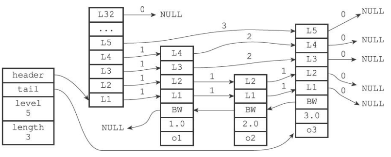
```
struct zskiplistNode{
	struct zskiplistLevel{						//层
		struct zskiplistNode *forward;			//前进指针
		unsigned int span;						//跨度
	} level[];
	struct zskiplistNode *backward;				//后退指针
	double score;								//分值
	robj *obj;									//成员对象
};

struct zskiplist{
	struct skiplistNode *header, *tail;		//表头节点与表尾节点
	unsigned long length;					//表中节点的数目
	int level;								//表中层数最大的节点的层数，表头节点的层高不计算在内
};
```
1、跳表节点的level数组可以包含多个元素，每个元素都包含一个指向其他节点的指针，程序可以通过这些层来加快访问其他节点的速度，一般层数越多，访问其他节点的速度就越快。                 
2、每层都有一个指向表尾方向的前进指针，用于从表头向表尾方向访问节点。                      
3、层的跨度用于记录两个节点之间的距离，用来计算排位:在查找某个节点的过程中，将沿途访问的所有层的跨度累计起来，得到的结果就是目标节点在跳表中的排位。                  
4、节点的后退指针用于从表尾向表头方向访问节点，每次只能后退至前一个节点。                    
5、跳表中所有节点都按分值从小到大来排序，成员对象指向一个保存着SDS值的字符串对象。在同一个跳表中，各个节点保存的成员对象必须是唯一的，但是分值可以是相同的。                    
6、使用zskiplist来管理跳表节点，可以快速访问表头节点与表尾节点，或者快速获取跳表节点的数目。                 

## 整数集合
整数集合是集合键的底层实现之一，当一个集合只包含整数值元素，并且这个集合的元素数量不多时，Redis就会使用整数集合作为集合键的底层实现。          
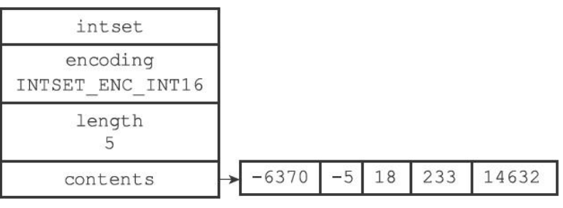
```
struct intset{
	uint32_t encoding;		//编码方式
	uint32_t length;		//集合包含的元素数量
	int8_t contents[];		//保存元素的数组
};
```
contents数组是整数集合的底层实现:整数集合的每个元素都是contents数组的一个数组项，各个项在数组中按值的大小从小到大有序地排序，并且数组中不包含任何重复项。length记录了整数集合包含的元素数量。encoding决定了contents数组的真正类型，int16_t,int32_t,int64_t。				            
每当添加类型比整数集合中所有元素的类型都要长的元素时，整数集合需要先进行升级才能添加新元素。升级就是提升所有元素的类型大小的同时保持底层数组的有序。升级在提升了数组的灵活性(可以存储多种类型的数据)的同时也最大限度地节约了内存。          

## 压缩列表
压缩列表是列表键和哈希键的底层实现之一。当一个列表键只包含少量列表项，并且每个列表项要么就是小整数值，要么就是长度比较短的字符串，那么Redis就会使用压缩列表来做列表键的底层实现。当一个哈希键只包含少量键值对，比且每个键值对的键和值要么就是小整数值，要么就是长度比较短的字符串，那么Redis就会使用压缩列表来做哈希键的底层实现。
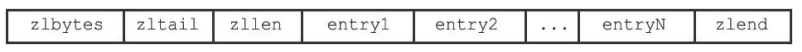
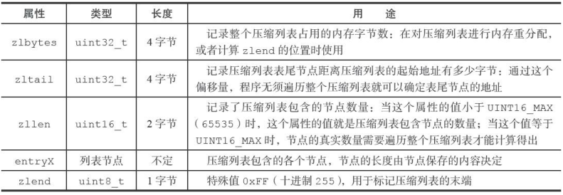

previous_entry_length属性记录了压缩列表前一个节点的长度，可以通过其从表尾向表头遍历，小于254字节时此属性为1字节，大于等于254字节时此属性为5字节。encoding属性记录了节点的content属性所保存的数据类型以及长度。content属性负责保存节点的值。      
压缩链表可能低概率遇到连锁更新的问题:在压缩链表中所有previous_entry_length属性都为1字节的情况下，当往表头插入一个大于等于254字节的节点时，会使得下一个节点的previous_entry_length属性扩展为5字节，如果这使得这个节点长度大于等于254字节，那么之后节点的previous_entry_length属性也需要扩展，就会形成连锁反应。

## 对象
Redis并没有直接上述数据结构来实现键值对数据库，而是基于这些数据结构创建了一个对象系统，这个系统包含字符串对象、列表对象、哈希对象、集合对象和有序集合对象这五种类型的对象，每种对象都用到了至少一种数据结构。
```
struct redisObiect{
	unsigned type:4;			//类型
	unsigned encoding:4;		//编码，即是该对象使用了什么数据结构作为对象的底层实现
	void *ptr;					//指向底层实现数据结构的指针
	int refcount;				//引用计数
	...
};
```
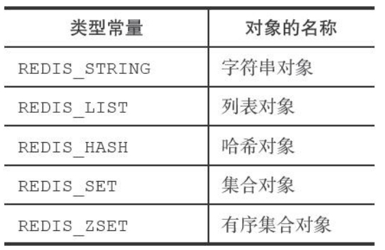
Redis使用对象来表示数据库中的键和值，每次当我们在Redis的数据库中新创建一个键值对时，我们至少会创建两个对象，一个对象用作键值对的键(总是一个字符串对象)，另一个对象用作键值对的值(可以为五种对象其中一种)。列表键意味着键为字符串对象，值为列表对象。	
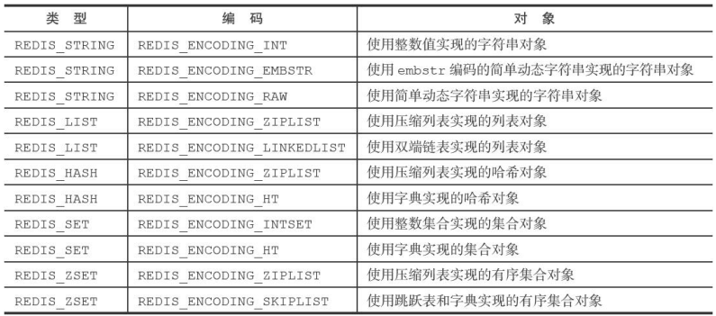	
对象通过使用不同的编码来优化在某一场景下的效率。       	    
对象通过引用计数来实现自动释放对象并进行内存回收。