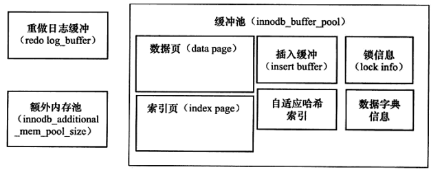

- [MYSQL](#mysql)
  - [MyISAM与InnoDB的区别](#myisam与innodb的区别)
  - [InnoDB的关键特性](#innodb的关键特性)
    - [Insert Buffer插入缓冲](#insert-buffer插入缓冲)
  - [InnoDB的后台线程分类](#innodb的后台线程分类)
  - [InnoDB的内存管理](#innodb的内存管理)
    - [缓冲池](#缓冲池)
    - [LRU List](#lru-list)
    - [Free List](#free-list)
    - [Flush List](#flush-list)
    - [Check Point机制](#check-point机制)
- [REDIS](#redis)

#   MYSQL
##  MyISAM与InnoDB的区别
|   MyISAM  |   InnoDB  |   
|   :---:     |   :---:     |
|   不支持事务  |   支持事务    |
|   不支持外键  |   支持外键    |
|   索引的叶子节点存放的是数据文件的地址指针  |   聚集索引的叶子节点存放的是磁盘上实际的数据文件，非聚集索引的叶子节点存放的是主键值    |
|   支持表级锁  |   支持表级锁与行级锁  |
|   可以没有主键  |   必须要有主键，如果不主动设置会默认产生一个  |

##  InnoDB的关键特性    
### Insert Buffer插入缓冲
使用条件:非聚集且不唯一的索引   
在进行插入操作时，插入顺序很可能不是顺序的，如果不使用InsertBuffer则需要离散的访问非聚集索引页(随机读取的性能低于顺序读取)。    
使用InsertBuffer后，先判断插入或更新的非聚集索引页是否存在于InsertBuffer中，如果存在则直接插入，如果不存在则先加入到一个InsertBuffer中。之后在一定的频率和条件下进行InsertBuffer与非聚集叶子节点的合并操作。    
缺点:进行大量的非聚集且不唯一的索引的插入操作时(使用了大量InsertBuffer)，若此时数据库发生了宕机，会有很多InsertBuffer没有合并到非聚集索引中去，恢复会需要很长时间。   
Change Buffer:InsertBuffer的升级，包含Insert Buffer(INSERT、UPDATE)、Delete Buffer(DELETE)、Purge Buffer。使用条件仍为非聚集且不唯一的索引。一阶段使用InsertBuffer或DeleteBuffer将记录标记为删除，二阶段使用PurgeBuffer将记录真正删除。

##  InnoDB的后台线程分类
1、Master Thread    
负责将缓冲池中的数据异步刷新到磁盘，保证数据的一致性  
2、IO Thread  
使用异步IO(AIO)来处理IO请求   
3、Purge Thread   
回收已经使用并分配的undo页  
4、Page Cleaner Thread    
负责脏页的刷新

##  InnoDB的内存管理
### 缓冲池   
   
缓冲池就是一块内存区域，用来弥补CPU与磁盘间速度的鸿沟。   
读取页时，首先会检查缓冲池，如果缓冲池中有，则缓冲命中，直接读取缓冲池中的数据页。如果缓冲池中没有，则读取磁盘中的数据页，并把其存放在缓冲池中。  
修改页时，会修改位于缓冲池中的页，此时这种页被称为"脏页"，脏页会以一定的频率一起刷新到磁盘上。

### LRU List
使用LRU链表来管理缓冲池中已使用的页。InnoDB对其做了相应的改进，从磁盘上最新读取的页不是直接插入链表头部，而是链表中间midpoint的地方，midpoint之前的数据为活跃的数据(热端，默认大小5/8)，之后的数据为相对不活跃的数据(冷端，默认大小3/8)，通过设置innodb_old_blocks_time可以让冷端数据等待一段时间之后再次被访问才能移到热端。   
目的：全局扫描与预读到的页可能不是热点数据，直接插入LRU链表头可能会把真正的热点数据置换出去。  

### Free List
使用Free链表来管理缓冲池中未使用的页。当缓冲池需要使用页时，首先从Free链表上查询是否有可用的页，如果有则从Free链表上取走一页，放入LRU链表上。如果没有，则根据LRU算法淘汰LRU列表末尾的一页分配给新页。

### Flush List    
使用Flush链表来管理需要刷新回磁盘的脏页，脏页实际仍然存放在LRU链表。当LRU中的页被修改后成为脏页，就将该页加入Flush列表，通过CheckPoint机制按列表顺序刷新回磁盘。

### Check Point机制
当数据库宕机时，只需对CheckPoint之后的redo日志进行重做，之前的脏页已经刷新回磁盘。      
1、Sharp CheckPoint     
将所有脏页都刷新回磁盘    
时机:   
+ 数据库关闭时产生CheckPoint。  
     
2、Fuzzy CheckPoint
将部分脏页刷新回磁盘    
时机:     
+ Master Thread CheckPoint:Master线程每隔1s或10s异步刷新Flush链表，产生CheckPoint      
+ Flush_LRU_List CheckPoint:当Free链表少于100时，将LRU链表尾部的页移除，若有脏页则产生CheckPoint     
+ Async/Sync Flush CheckPoint:当redo日志使用率超过Async/Sync阈值时为了循环使用redo日志，产生CheckPoint     
+ Dirty Page too much:脏页数目太多，为了确保缓冲池有足够可用的页，产生CheckPoint   

#   REDIS